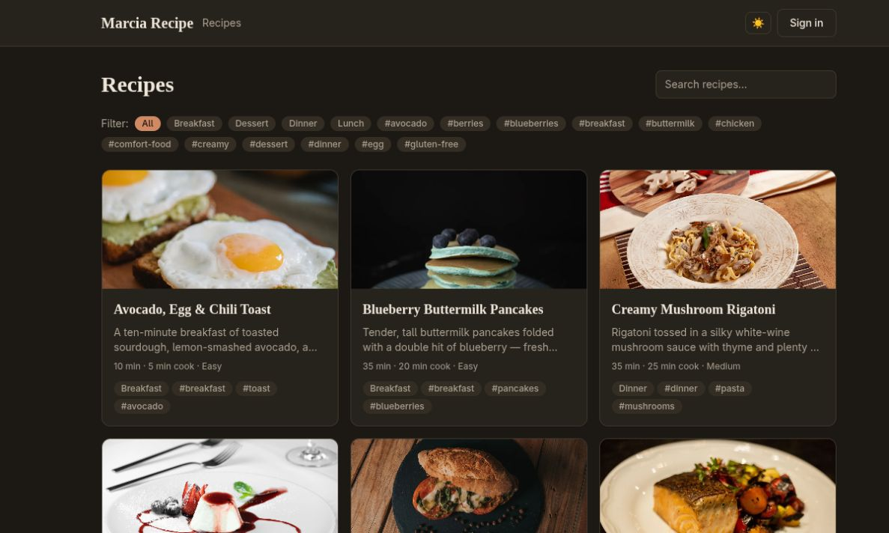
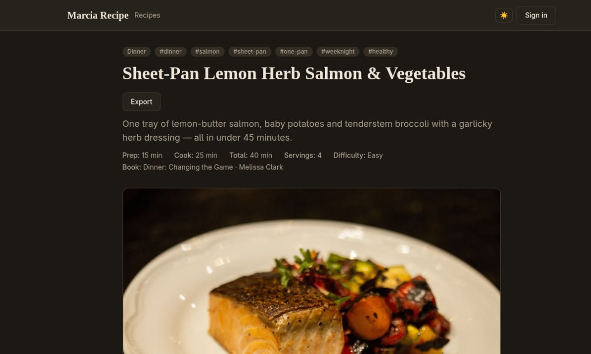
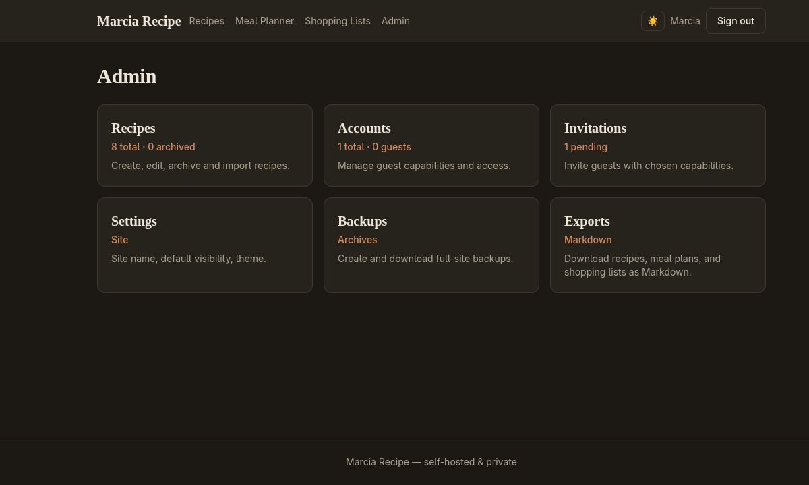
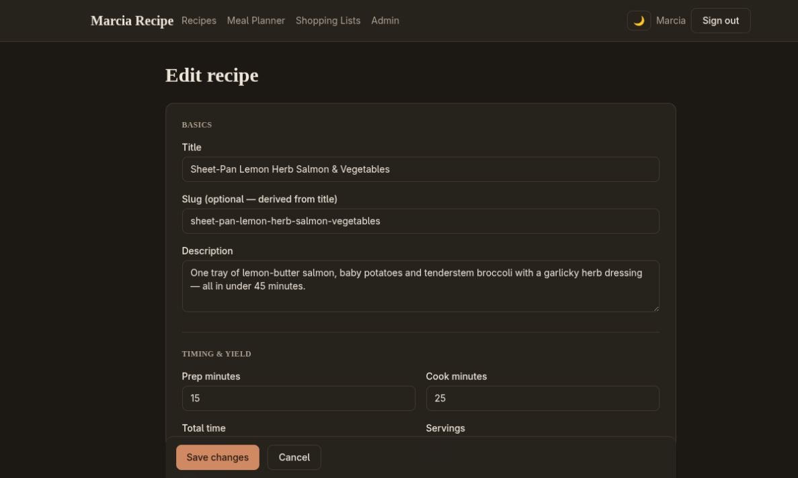
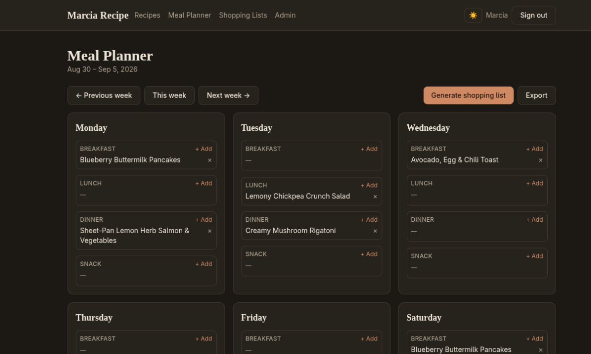
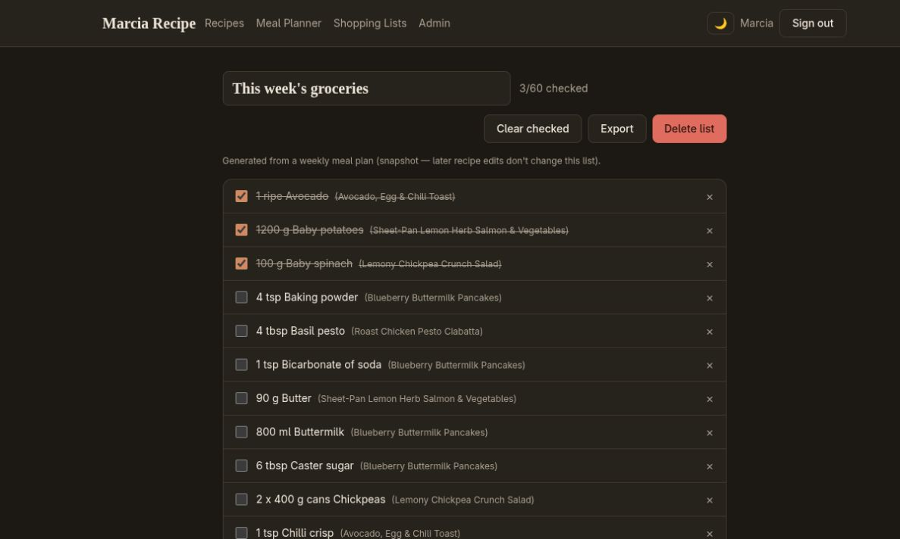
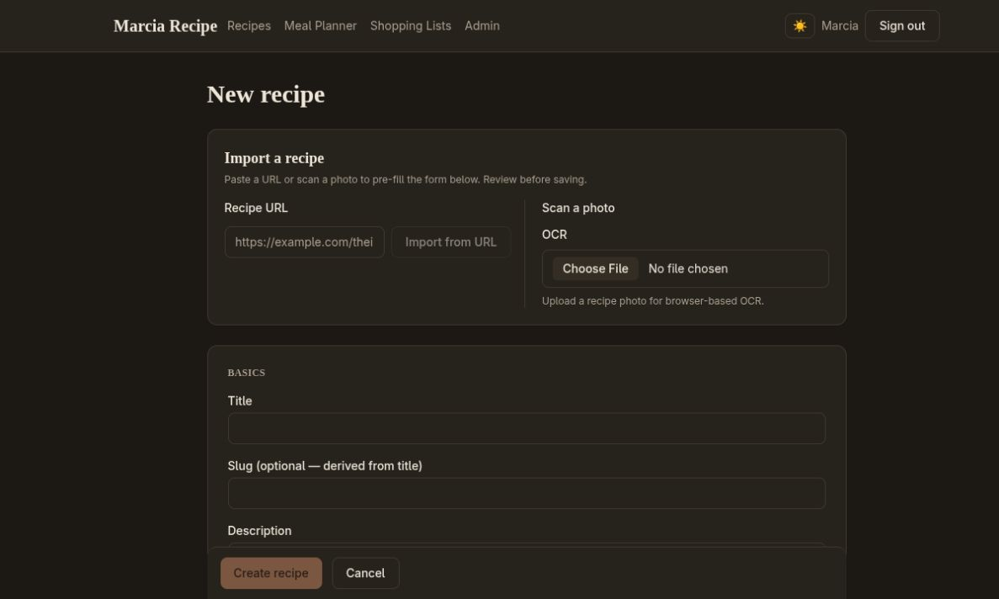
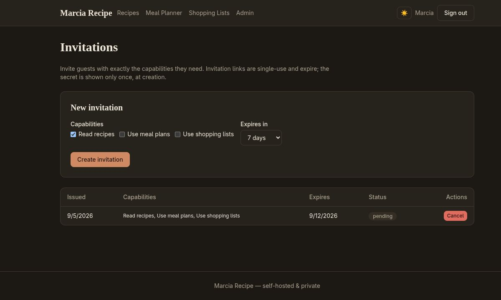
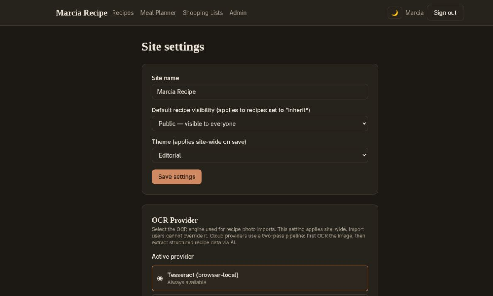

# Marcia Recipe

Marcia Recipe is a self-hosted, flat-file recipe binder for **one owner and their invited guests**.
It is built with Next.js 16 and stores everything as JSON files on a persistent writable
filesystem — **no database required**. It is designed for a single household: fewer than 2,000
recipes, fewer than 25 accounts, and low concurrent traffic.

> **Why flat-file?** One owner, one instance, one directory to back up. No database server to
> run, no migrations to forget, no state to lose when a container restarts. Copy the data
> directory and you have a complete, restorable snapshot.

---

## Features

### Recipes
- Full recipe management: create, edit, archive, and restore
- Ingredients, steps, and Markdown-formatted notes
- Tags, categories, difficulty, servings, prep/cook times, and source URLs
- Per-recipe media uploads (images validated, resized, and converted to WebP via Sharp)
- Slug-based URLs with prior-slug alias preservation (renames never break links)
- Three visibility levels: **Public**, **Members-only**, and **Owner-only** (plus a site-wide default)

### Accounts & invitations
- One owner account, created during first-run setup
- Owner-issued invitations with individually assigned guest capabilities:
  - **Read recipes** (`recipes.read`)
  - **Use meal plans** (`mealPlans.use`)
  - **Use shopping lists** (`shoppingLists.use`)
- Invitations are single-use, secret-hashed at rest, and expire on a schedule
- Guest access can be revoked instantly — capabilities reload on every protected request

### Personal tools (per-account, private)
- Weekly **meal planner** tied to recipes by immutable ID
- **Shopping lists** generated from meal plans, with manual items and check-off state
- Saved shopping lists are snapshots — recipe edits never silently alter a saved list
- Archived recipes show as tombstones in historical meal plans

### Recipe import
- **URL import** with JSON-LD, Microdata, and RDFa extraction
- Fallback fetch strategies: direct, print-view, Wayback Machine, and Jina reader
- SSRF-hardened fetcher: validates protocol, ports, DNS, redirects, response size, and timeouts
- **OCR import** (browser-side Tesseract.js available, but it's not very good; server-side Mistral OCR when
  `MISTRAL_API_KEY` is set)
- Imports and OCR produce **drafts** — nothing is saved until the owner reviews and submits

### Search, themes, and PWA
- Fuzzy search (Fuse.js) over a per-request, visibility-filtered search index
- Four visual themes (Editorial, Warm, Ocean, Minimal) with light/dark modes
- Installable PWA shell with offline fallback
- Service worker precaches only the static shell — **never** recipe content, media, or API responses

### Storage & operations
- Atomic JSON writes (temp file → fsync → rename) — a crash leaves either the old or new file, never a torn write
- Cross-process filesystem locking (`proper-lockfile`)
- Zod schema validation on every loaded document
- Schema migrations with a version-aware CLI
- Backup / restore CLI with dry-run and validation
- Derived indexes (search, thumbnails) are disposable and rebuildable

### Security
- Auth.js (next-auth v5) Credentials provider with JWT sessions — **no database adapter**
- JWTs carry only the account ID and session version — never capabilities
- Capabilities are reloaded from the account file on **every** protected operation
- Login rate limiting by username and client address
- Secure, HTTP-only, SameSite cookies
- Same-origin validation on all cookie-authenticated mutations
- Owner password reset via local CLI (no email dependency)

---

## Screenshots

Screenshots live in [`docs/screenshots/`](docs/screenshots) and are captured from a running
local instance. See [`docs/screenshots/README.md`](docs/screenshots/README.md) for capture
instructions.

| View | Screenshot |
| --- | --- |
| Recipe list (public) |  |
| Recipe detail |  |
| Admin dashboard |  |
| Recipe editor |  |
| Meal planner |  |
| Shopping list |  |
| Import panel (URL + OCR) |  |
| Invitations manager |  |
| Settings & themes |  |

> If a screenshot file is missing, run the local dev server (`npm run dev`) and follow the
> capture steps in `docs/screenshots/README.md`.

---

## Requirements

- **Node.js 22 LTS** or newer (required by Next.js 16, Sharp, Undici, and the test toolchain)
- A **persistent writable filesystem** for `DATA_ROOT`
- **One writable application instance** (no cluster mode, no multiple replicas against the same
  data directory)

---

## Quick start (local development)

```sh
npm ci
cp .env.example .env   # then edit values
npm run dev
```

Open `http://localhost:3000`, then visit `/setup` once and enter your `SETUP_TOKEN` to create
the owner account. Web setup is disabled after the first owner exists.

### Environment variables

| Variable | Required | Description |
| --- | --- | --- |
| `NODE_ENV` | yes | `development` / `test` / `production` |
| `DATA_ROOT` | yes | Absolute path to the mutable data directory |
| `AUTH_SECRET` | prod | ≥32 random chars; signs session JWTs |
| `SETUP_TOKEN` | prod | One-time token for first-run owner setup |
| `APP_ORIGIN` | prod | Public origin, e.g. `https://recipes.example.com` |
| `MISTRAL_API_KEY` | optional | Enables server-side Mistral OCR for imports |

Generate secrets with:

```sh
openssl rand -base64 48   # AUTH_SECRET
openssl rand -hex 16      # SETUP_TOKEN
```

---

## How to build

```sh
npm ci
npm run build
```

The production build uses Next.js `standalone` output, producing a self-contained
`.next/standalone/server.js` that runs without `next start`.

### Checks

```sh
npm run typecheck   # tsc --noEmit
npm run lint        # eslint .
npm test           # vitest run (unit tests)
npm run e2e         # playwright (browser smoke tests)
npm run build       # production build
```

---

## Branch system

This repository uses a four-branch system:

| Branch | Purpose |
| --- | --- |
| `main` | Main development branch. All feature work lands here first. |
| `for_personal` | Builds the personal instance deployed to Oracle Cloud. Pushes to this branch trigger the `Deploy Personal` GitHub Action. |
| `for_demo` | Builds the public demo instance deployed to Oracle Cloud. Pushes to this branch trigger the `Deploy Demo` GitHub Action. The demo is **seeded and auto-reset every hour** — see [Demo instance](#demo-instance) below. |
| `for_public` | Tagged releases for self-hosters who want to download and run their own instance. Releases are cut from this branch. |

### Demo instance

A live demo is hosted at **https://recipes-demo.inthesky.dev** (note the hyphen — underscores
are not valid in domain names per RFC 1034 and Let's Encrypt will not issue certificates for them).

- **Username:** `demo`
- **Password:** `demo123456`

The demo is **reset to a seeded state every hour** (at :00 UTC) via a cron job on the host that
restores from a seed backup. The seed contains the owner account above and 8 sample recipes
(2 breakfast, 2 dinner, 2 lunch, 2 dessert) with images. Any changes made to the demo — new
recipes, edited recipes, new accounts — are wiped on the next reset.

The reset is also available as a manual GitHub Action (`Reset Demo` workflow) for on-demand resets.

> **Security note:** the demo account is intentionally low-security. Do not store anything
> sensitive on the demo instance. The personal instance (`for_personal` branch) is separate and
> uses its own credentials and data volume.

---

## How to deploy

Marcia Recipe supports two deployment modes. **For a full step-by-step guide to deploying on
Oracle Cloud's Always Free tier, see [`oracle_cloud.md`](oracle_cloud.md).**

### Option A — Docker (recommended)

Create a `.env` beside `docker-compose.yml`:

```dotenv
AUTH_SECRET=replace-with-at-least-32-random-characters
SETUP_TOKEN=replace-with-a-long-one-time-setup-token
APP_ORIGIN=https://recipes.example.com
```

Then:

```sh
docker compose up -d --build
docker compose logs -f app
```

The named `marcia_recipe_data` volume holds all accounts, recipes, media, and personal data.
Back it up regularly and keep a copy off the host.

Place a TLS reverse proxy (Caddy, Nginx) in front of port 3000. **Never expose the dev server
or port 3000 directly to the public internet.** A minimal Caddyfile is in
`deploy/Caddyfile.example`.

### Option B — Direct Node.js

```sh
npm ci
npm run build
NODE_ENV=production DATA_ROOT=/var/lib/marcia-recipe \
  AUTH_SECRET='...' SETUP_TOKEN='...' APP_ORIGIN='https://recipes.example.com' \
  npm start
```

A systemd unit example is at `deploy/marcia-recipe.service`:
- Copy it to `/etc/systemd/system/`
- Create a dedicated `marcia-recipe` user
- Create `/var/lib/marcia-recipe`
- Put secrets in `/etc/marcia-recipe/marcia-recipe.env` (mode `0600`)
- Use `deploy/Caddyfile.example` as a TLS reverse-proxy starting point

---

## How to use

### First run
1. Start the app and visit `/setup`
2. Enter your `SETUP_TOKEN` to create the owner account
3. Log in and configure site settings (default visibility, theme) at `/admin/settings`

> The local CLI can create the owner without a web setup token:
> ```sh
> npm run cli:create-owner
> npm run cli:reset-password -- --username owner
> ```

### Adding recipes
- **Manual**: `/admin/recipes/new` — fill in title, ingredients, steps, notes, media, visibility
- **URL import**: `/admin` → Import panel → paste a recipe URL → review the draft → save
- **OCR import**: `/admin` → Import panel → upload an image → review the extracted draft → save
- Imports and OCR **never** save directly — you always review a draft first

### Inviting guests
1. `/admin/invitations` → New invitation
2. Choose capabilities (Read recipes / Use meal plans / Use shopping lists)
3. Set an expiry
4. Send the one-time invitation link — the secret is shown **only once**
5. The guest follows the link, creates an account, and lands with the assigned capabilities

### Meal planning & shopping lists
- `/meal-planner` — drag recipes into a weekly grid (requires `mealPlans.use`)
- Generate a shopping list from a plan (requires `shoppingLists.use`)
- `/shopping-lists` — check items off, add manual items, export

### Backups & maintenance
```sh
npm run cli:backup -- --data-root /var/lib/marcia-recipe
npm run cli:restore -- --file backups/marcia-backup-...tar.gz --dry-run
npm run cli:restore -- --file backups/marcia-backup-...tar.gz --force
npm run cli:migrate -- --data-root /var/lib/marcia-recipe
npm run cli:rebuild-indexes -- --data-root /var/lib/marcia-recipe
```

Always back up before migration or restore. Restore validation runs before any canonical
files are replaced; `--force` is required to replace an existing data root.

---

## Security & privacy notes

- Guest capabilities reload from the account file on every protected request — revocation is immediate
- JWTs contain only the account ID and session version; they are **not** the authorization source of truth
- Private recipe pages, search entries, media, API responses, and personal data are **not** service-worker cached
- URL import validates protocol, ports, DNS results, redirects, response size, content type, and timeouts
- Recipe imports and OCR produce drafts; nothing is saved until the owner reviews and submits
- Keep `DATA_ROOT` outside the repository and never commit `.env` or backup archives

---

## Documentation

- [`README.md`](README.md) — this file (features, build, deploy, usage)
- [`ARCHITECTURE.md`](ARCHITECTURE.md) — how the app is built, what each part is, and why
- [`oracle_cloud.md`](oracle_cloud.md) — step-by-step Oracle Cloud Always Free deployment
- [`scripts/generate-demo-seed.ts`](scripts/generate-demo-seed.ts) — export the live demo catalog into a repo-managed seed directory
- [`scripts/restore-demo-seed.ts`](scripts/restore-demo-seed.ts) — rebuild a DATA_ROOT from the repo-managed seed directory

---

## License

UNLICENSED — private, self-hosted software.